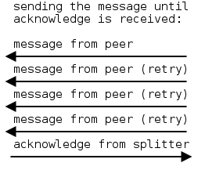
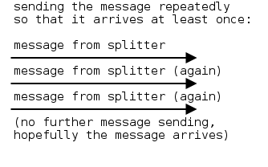
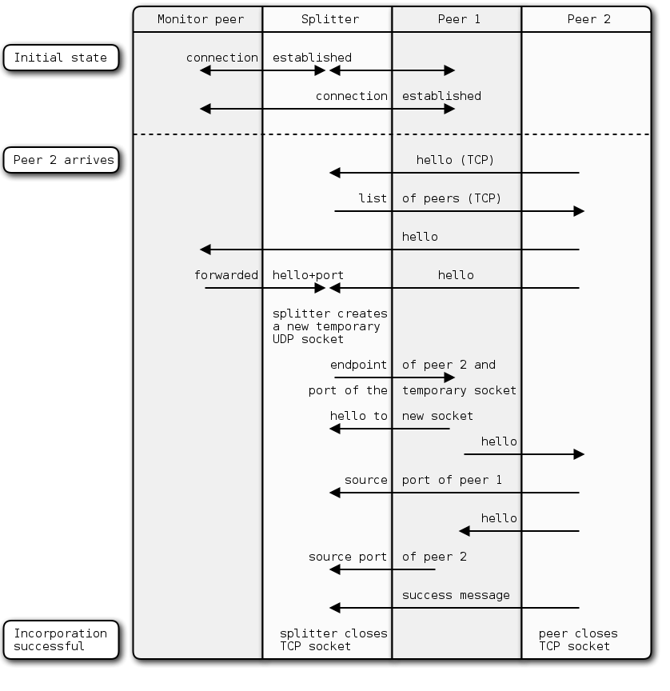
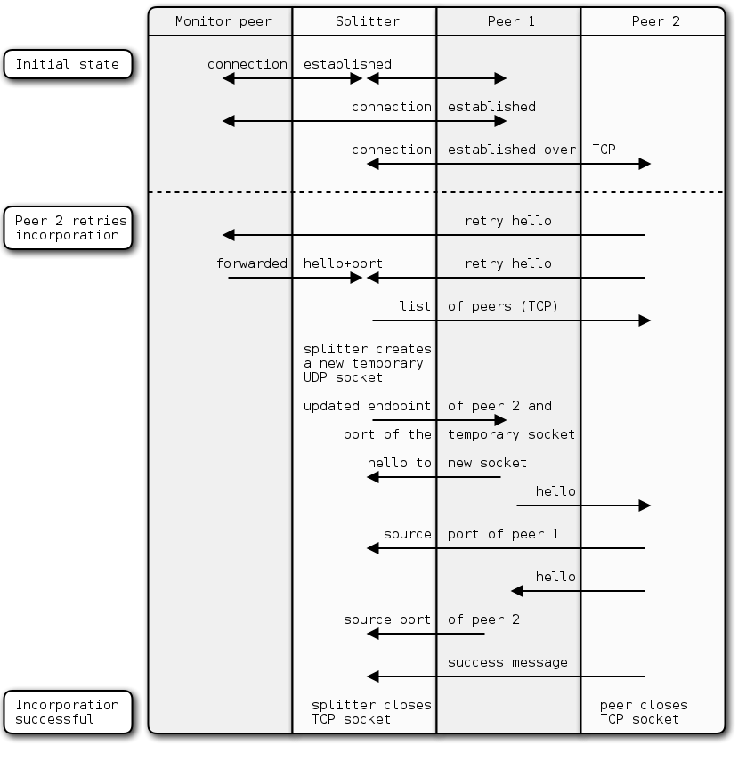

---
title: NAT traversal techniques
...

NAT traversal in P2PSP protocol
===============================

Information about NAT traversal in the P2PSP protocol can be found in
the \[P2PSP protocol documentation\]\[1\] and in \[this
slideshow\]\[2\]. This document documents the NAT traversal methods
developed in the GSoC 2015 project “NAT traversal using UDP hole
punching” as a python implementation in the NAT Traversal Set of rules
(NTS) classes.

NAT types
=========

The behaviour of different implementations of NAT devices (i.e.
routers), can be grouped into a few different NAT types. A short
description from @3:

-   **Full-cone NAT (FCN)**:

    > “A full-cone NAT is one where all requests from the same intern al
    > IP address and port are mapped to the same external IP address
    > and port. Any external host can send a packet to the internal host
    > simply by sending a packet to the mapped external address.”

-   **Restricted cone NAT (RCN)**:

    > “A restricted-cone NAT is one where all requests from the same
    > internal IP address and port are mapped to the same external IP
    > address and port. Unlike a full-cone NAT though, an external host
    > can send a packet to the internal host only if the internal host
    > had previously sent a packet to that external host.”

-   **Port-restricted cone NAT (PRCN)**:

    > “A port-restricted cone NAT is like a restricted-cone NAT, but the
    > restriction also includes port numbers. An external host can send
    > a packet to the internal host only if the internal host had
    > previously sent a packet to that external host on the same
    > port number.”

-   **Symmetric NAT (SYM)**:

    > “A symmetric nat is a NAT where all requests from the same
    > internal IP address and port to a specific destination IP address
    > and port are mapped to the same external source IP address
    > and port. If the same internal host sends a packet with the same
    > source address and port to a different destination, a different
    > mapping is used (these mappings are referred to as
    > NAT translations). Only the external host that receives a packet
    > can send a packet back to the internal host.”

    As described in @4, the symmetric NATs can be divided again into
    these three subtypes, depending on the allocation of the source port
    of the NAT:

    -   :

        The public source port of the NAT is the same as the source port
        of the local host. If this NAT behaviour is detected, prediction
        of the public port is trivial.

    -   :

        To allocate a new public source port, the next free port number
        is selected, so the port number is incremented each time. This
        is described in detail below.

    -   :

        For each new pair \`(dest. address, dest. port)\` a completely
        random and therefore unpredictable public source port
        is selected.

NAT type determination
======================

To be able to traverse a NAT device, the type of the NAT has to be
determined correctly. For this, the NAT types are grouped into port
preserving NAT devices (FCN, RCN, PRCN, SYMPP), and types with
destination dependent port allocation (SYMSP, SYMRP). The port
preserving types are not differentiated, as the NAT traversal overhead
unnecessary for FCN devices is less effort than detecting the FCN type,
and NAT traversal of RCN, PRCN, SYMPP can be handled equally. The
randomly source port allocating type is not handled differently than the
sequentially allocating type, as the allocated ports cannot be predicted
and the unnecessary port prediction overhead negligible.

To determine the port allocation method of a new peer A, it sends UDP
packets to the splitter and to the monitor peer(s), and the monitor
peers forward the source ports used at the new peer to the splitter.

Between two packets sent by the P2PSP software, another software behind
the same NAT could also send UDP packets to a new destination and the
measured port distance would be higher than the actual port step of the
NATs. Therefore the splitter calculates the distance between each source
port used by the new peer and combines them using the greatest common
divisor (GCD), to determine the port step of the NAT. Also, when a new
peer B arrives and connects to the now incorporated peer A, both peers
send the source port used by each other to the splitter. The splitter
then calculates the distance between the source port towards itself and
towards the other peer and combines the distance and the previously
determined port step using GCD, for each of the peers.

So the more monitor peers there are in the team, the more accurately
determined is the port step of a new peer before incorporating it into
the team, and the more peers there are in the team, the more accurately
determined is the port step of already incorporated peers.

If the determined port step is 0, the NAT is one of the FCN, RCN, PRCN,
SYMPP types and NAT traversal is trivial. Otherwise the P2PSP software
will try to predict the source ports chosen next by the NAT. See details
below.

UDP hole punching and port prediction
=====================================

UDP hole punching
-----------------

NAT devices (all but the FCN type) only forward packets from a peer to
the local network if previously a packet to the peer address and port
has been sent and therefore a NAT entry exists (for RCN, a packet must
have been sent to the peer address and \*\*any\*\* port). Therefore
hello packets are sent continuously between two peers until both peers
have received a packet from each other.

Source port prediction
----------------------

In case peer A and B want to connect to each other and peer A is behind
a NAT with a different source port for each destination, normal UDP hole
punching does not work:

1.  Peer A sends a packet to peer B, with a randomly generated source
    port; a NAT entry at peer A is created.

2.  The packet does not reach peer B, because there is no corresponding
    NAT entry at the NAT of peer B.

3.  Peer B sends a packet to peer A, with the same source port as for
    every destination; a NAT entry at peer B is created.

4.  The packet does not reach peer A, because the destination port at
    peer A that peer B sent to does not match the source port of the
    packet to peer B.

If peer A can predict the source port that will be allocated for the
packet from peer B, then peer A can send packets to this port and they
will be forwarded by the NAT as a matching NAT entry exists.

### Simple port prediction

When a new peer behind a sequentially allocating NAT wants to be
incorporated into the team, it sends hello packets to the splitter and
to the monitors, and then to all peers, one after another. For each new
destination, the allocated source port is increased by the port step of
the NAT. So for a given \`port\_step\` and a \`peer\_number\`, the
predicted source port is:

    predicted_source_port = source_port_to_splitter + peer_number * port_step

### Advanced port prediction

When during the sending of the hello packets to the peers another packet
is sent by any host behind the same NAT, a source port will be allocated
for that packet as well. So one port number is skipped and the following
outgoint packets will have a source port \`predicted\_source\_port +
port\_step\`. To increase the probability that the correct source port
is matched, the peers try various numbers of skips out of
\`0,1,...\`, and for each the predicted source port is:

    predicted_source_port = source_port_to_splitter + (peer_number + skips) * port_step

### Even more advanced port prediction

There are a few more things to consider when predicting source ports. In
the following paragraph it is assumed that the splitter has determined a
port distance of 10 and the third peer tries to predict the source port
of the newly arriving peer and tries 20 different ports to have good
chances:

1.  The port step cannot be determined reliably (as stated above). If
    the splitter measures a port distance of 10, it could actually be
    one of {1,2,5,10}. So there is a measured port distance and an
    actual port step.

2.  For each probable port step, different numbers of “skips” should be
    tried, because some source ports are skipped if the port is already
    taken by another UDP “connection”. So as the third peer is 3 port
    steps after the monitor, the ports {3,4,...}, {6,8,...},
    {15,20,...}, {30,40,...} should be tried (in addition
    to \`source\_port\_to\_splitter\`).

3.  The number of port “skips” depends on the assumed port step: If a
    port step of 10 is measured but a port step of 1 is assumed, then
    there must have been 9 port skips between the UDP packets to the
    splitter and to the monitor. So it is very likely that there will be
    also many port skips between the packets to the peers, so different
    numbers of skips should be tried: {3,4,5,6,7,8}. On the other hand,
    if both the measured and the assumed port step are 10, then there
    have been no port skips and it is less likely that some will occur
    between the packets to the peers, so few port skips are
    tried: {30,40}.

Two examples where a trivial implementation (assuming either a port step
of 1 or assuming the measured port distance as the port step) would
fail:

-   When a port step of 1 is assumed for all NATs, and the actual port
    step is 10, then the predicted ports will be {3,4,...,23}, while the
    actual taken port is one of {30,40,...}, depending on the number
    of skips.

-   If the assumed port step is 10 and the actual is 1, then the
    predicted ports will be {30,40,...,230}, while the actual taken port
    is one of {3,4,...}.

To solve this, an algorithm was developed that assumes different port
steps and for each assumes different numbers of skips, and calculates
probable `port_diffs` (in addition to `source_port_to_splitter`) given
any determined port distance `port_diff` and `peer_number` (the position
in the team of the peer that does the port prediction).

        # Get probable port steps
        factors = self.get_factors(port_diff)
        # Estimate how many port guesses will be made
        num_combinations = self.count_combinations(factors)
        # Influence the prediction to achieve the desired number of results
        count_factor = common.MAX_PREDICTED_PORTS/float(num_combinations)

        port_diffs = sorted(set(reduce(list.__add__, (list(
            # For each previous peer and each skip, the source port is incremented
            port_step * (peer_number + skips)
            # For each assumed port_step, "port_diff/port_step" different port skips
            # are tried, multiplied with count_factor to get the desired list length
            for skips in range(int(math.ceil(port_diff/port_step*count_factor))+1))
            # Each factor of port_diff is a possible port_step
            for port_step in factors))))

The desired number of results can be approximately achieved. For the
example above, the algorithm yields:

        port_diffs = [3, 4, 5, 6, 7, 8, 9, 10, 11, 12, 13, 14, 15, 16, 18, 20, 25, 0, 40, 50]

Limits for UDP hole punching and port prediction
------------------------------------------------

In some scenarios UDP hole punching with port prediction cannot work by
design. When one peer is behind a port-restricted NAT (PRCN, or a
symmetric NAT), it only receives messages if they come from an
address/port tuple that the peer previously sent a message to. If the
other peer is behind a NAT with an randomly (not sequentially) allocated
source port, then the first peer cannot predict the source port of a
message from the second peer and send a message to this endpoint. So a
peer with port-restricted NAT and a peer with a randomly source port
allocating NAT cannot send messages to each other.

To determine the possible combinations, the NAT types can be divided
into three classes:

1.  Not port-restricted, with a predictable port number (FCN, RCN).

2.  Port-restricted, with a predictable port number (PRCN,
    SYMPP, SYMSP).

3.  Port-restricted, with an unpredictable port number (SYMRP).

This assumes that all symmetric NAT implementations are port-restricted.
For these three classes, the following combinations theoretically can
work:

        Peer1\2 | 1.  | 2.  | 3.
        =========================
        1.      | yes | yes | yes
        2.      | yes | yes | no
        3.      | yes | no  | no

Using the six different NAT types, the table looks like this:

        Peer1\2 | fcn   | rcn   | prcn  | sympp | symsp | symrp
        =========================================================
        fcn     | yes   | yes   | yes   | yes   | yes   | yes
        rcn     | yes   | yes   | yes   | yes   | yes   | yes
        prcn    | yes   | yes   | yes   | yes   | yes   | no
        sympp   | yes   | yes   | yes   | yes   | yes   | no
        symsp   | yes   | yes   | yes   | yes   | yes   | no
        symrp   | yes   | yes   | no    | no    | no    | no

This shows that most combinations are possible, especially as according
to \[this paper\]\[5\] only few NAT devices are symmetric ones. However
this also means that if there is already a peer behind a port-restricted
NAT in the team, a peer with a randomly port allocating NAT cannot join
the team at all (or vice versa).

Implementation of the NAT Traversal Set of rules
================================================

Reliable message sending over UDP
---------------------------------

The P2PSP software uses TCP during initialization and incorporation of a
new peer in a team. Afterwards UDP is used due to its low latency needed
for live video broadcasting. As UDP is per design an unreliable protocol
and packets may drop or arrive several times in any order, important
data (needed for establishing connections between peers) is sent
continuously in regular intervals. The receiver then sends exactly the
same message as an acknowledge back to the sender:

The splitter has the most important role in P2PSP streaming. To reduce
load on the splitter, it does not automatically resend messages
continuously in a thread but only replies to peers if a message is
received. To ensure that a message reaches the peer, it is sent several
(currently 3) times at once:

The NAT traversal classes are developed in such a way that repeatedly
arriving messages do not affect the communication between peers.

SYMSP source port update
------------------------

The splitter saves the last known source port of all peers. When a new
peer arrives a long time after the last peer has arrived, then this
information may be out of date, if another UDP packet has been sent from
any host behind the same SYMSP NAT. To retrieve the currently allocated
source port of such a peer, during incorporation of a new peer all
already incorporated peers with a \`port\_step &gt; 0\` send a hello
message to a new temporary UDP socket at the splitter, for which a new
source port at the peers is allocated. So if the arriving peer fails to
connect to one of the peers, when retrying incorporation it can rely on
an up to date source port.

NAT traversal method
--------------------

The sequence of messages when a new peer is arriving and another peer
has already been incorporated into the team is shown in the diagram
below:

1.  Peer 1 already has been incorporated into the team and communicates
    with the splitter and monitor over UDP.

2.  A new peer 2 connects to the splitter over TCP and receives the
    configuration as well as the public endpoints of the peers in the
    team, including the determined port step of the NAT of each peer.

3.  Peer 2 continuously sends hello messages to the splitter and the
    monitor, each until an acknowledge is received.

4.  The monitor forwards the hello message to the splitter, appending
    the source port of peer 2 towards the monitor.

5.  The splitter determines the port step of peer 2 using the
    hello messages.

6.  The splitter binds a new socket to a random port and sends address,
    port and determined port step of peer 2 and the port of the new
    socket to peer 1.

7.  Peer 1 sends a hello message to the new splitter socket to determine
    its currently allocated source port for later peer arrivals.

8.  Peer 1 and 2 start sending hello messages to each other, each for a
    number of predicted possible ports, until an acknowledge
    is received.

9.  When receiving a hello message, the peers send the used source port
    of the other peer to the splitter to determine the port step more
    accurately and to save the currently allocated source port.

10. After having received a hello message from peer 1, peer 2 sends a
    message of success to the splitter.

11. The splitter and peer 2 close their TCP socket.

The same principle applies if there is more than monitor or more than
one already incorporated peer.

Retrying incorporation
----------------------

When a peer fails to receive hello messages from one or more
incorporated peers, it retries to join the team with a new UDP socket:

1.  Peer 1 already has been incorporated into the team and communicates
    with the splitter and monitor over UDP.

2.  Peer 2 closes its UDP socket and creates a new one, to have
    different source ports.

3.  Peer 2 sends a retry message to the splitter and the monitor, each
    until an acknowledge is received.

4.  The splitter sends the public endpoints of the peers in the team,
    including the determined port step of the NAT of each peer. This is
    necessary as the peer list or port information could have changed
    since peer 2 tried to get incorporated.

5.  The monitor forwards the retry message to the splitter, appending
    the source port of peer 2 towards the monitor.

6.  The splitter determines the port step of peer 2 using the
    retry messages.

7.  The splitter binds a new socket to a random port and sends address,
    port and determined port step of peer 2 and the port of the new
    socket to peer 1.

8.  Peer 1 sends a hello message to the new splitter socket to determine
    its currently allocated source port for later peer arrivals.

9.  Peer 1 and 2 start sending hello messages to each other, each for a
    number of predicted possible ports, until an acknowledge
    is received.

10. When receiving a hello message, the peers send the used source port
    of the other peer to the splitter to determine the port step more
    accurately and to save the currently allocated source port.

11. After having received a hello message from peer 1, peer 2 sends a
    message of success to the splitter.

12. The splitter and peer 2 close their TCP socket.

As above, the same principle applies if there is more than monitor or
more than one already incorporated peer.

After the splitter has received a message of success, a peer cannot
retry incorporation anymore. This is to ensure that an attacker cannot
disturb the communication of a peer once it is incorporated into the
team.
